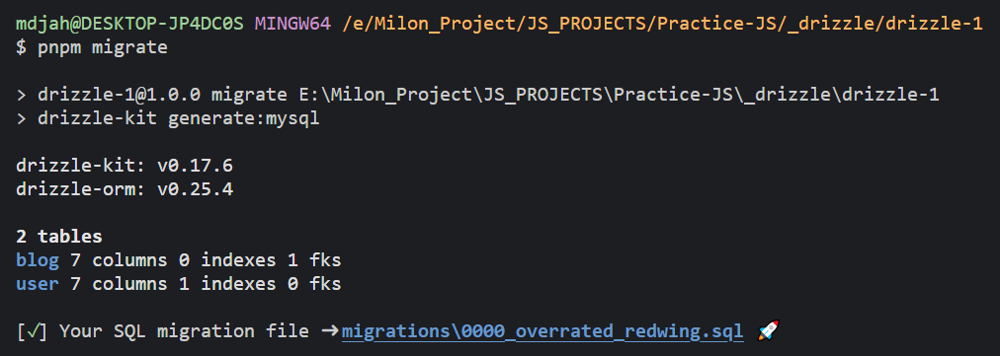

### Setup ts project

```bash
npm init -y
pnpm i drizzle-orm mysql2
pnpm i -D typescript ts-node @types/node drizzle-kit nodemon
npx tsc --init
mkdir src
# then copy paste tsconfig from here: https://github.com/milon27/nestpress/blob/master/tsconfig.json
```

### Create db tables and db config

- src/db/
  - db.ts [db connection/config file]
  - schema
    - user.schema.ts
    - blog.schema.ts

### [Run migration](https://github.com/drizzle-team/drizzle-kit-mirror)

- create a config file `drizzle.config.json`
- add these config for mysql

  ```json
  {
    "out": "./migrations",
    "schema": "./src/db/schema",
    "breakpoints": true
  }
  ```

- now run `drizzle-kit generate:mysql` or `pnpm migrate`



- now run `pnpm db:deploy` to apply migration to database
  - this will run the migrator in `.drizzle/migrator.ts` file which will read all of our migrations and apply those in db.

### some important doc

- [main documentation](https://orm.drizzle.team/)
- [relation](https://orm.drizzle.team/docs/rqb)
- [mysql2 core](https://github.com/drizzle-team/drizzle-orm/blob/main/drizzle-orm/src/mysql-core/README.md)
- [joins](https://github.com/drizzle-team/drizzle-orm/blob/main/docs/joins.md)
